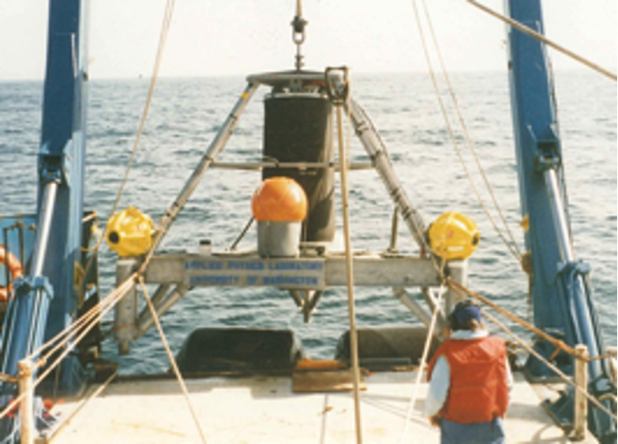

(acoustics-source)=
# Sound Sources

From our everyday experience, we encounter many sources of sound in our environment: A knuckle rapping on a door, the wind blowing through the leaves of tree, a group of people having a conversation... While these sound sources are all very different from one another, they each have common properties that we can use to describe and compare them. These include the amplitude of the sound being produced, the changes in the sound over time, and the directions in which the sound is being projected. In the following notebook, we will look closely at these descriptors of sound, with a particular focus on sonar systems.

## Source level

Source level (SL) is a measure of the loudness of a sound source. From the orca examples, when Ola is [_purely listening_](acoustics-intro_orca_comms),

$RL = SL - TL,$

or when Ola is [_pinging and listening_]((acoustics-intro_orca_fish_echo)),

$RL = SL - 2TL + TS,$

higher values of SL lead to higher received levels. As we will see, the source level term can be modified by aspects of the sound source such as its directionality, which we can introduce into the sonar equation to get a better description of the acoustic system.

## Sonar systems

Before diving in, it's worth talking about what we mean when we say "sonar systems." These usually refer to an human-made sound producing and/or receiving system that operates underwater. The basic idea behind a sonar is that it takes an electronic signal, typically a voltage that varies in time, and feeds that signal into a transducer which transforms that voltage into mechanical motion that generates sound. Any device that converts energy from one form to another is called a **transducer.** For example, the speaker in your headphones uses an electrical current to move a magnet which vibrates a surface against the air to produce sound. There are many types of transducers used in the design of sonars and the choice of transducer is often determined by the characteristics of the sound that needs to be produced. For example, an echosounder might use a small disk of piezoelectric material to produce a high-frequency, narrow beam of sound while scientists trying to transmit low-frequency sound across the Pacific Ocean used the 3-ton sound source pictured below.

We will begin by considering a simple model of sound source (the baffled, circular piston) and consider how the transducer's size and shape as well as the frequency at which it is driven, impact the character of the sound field that is emitted.
