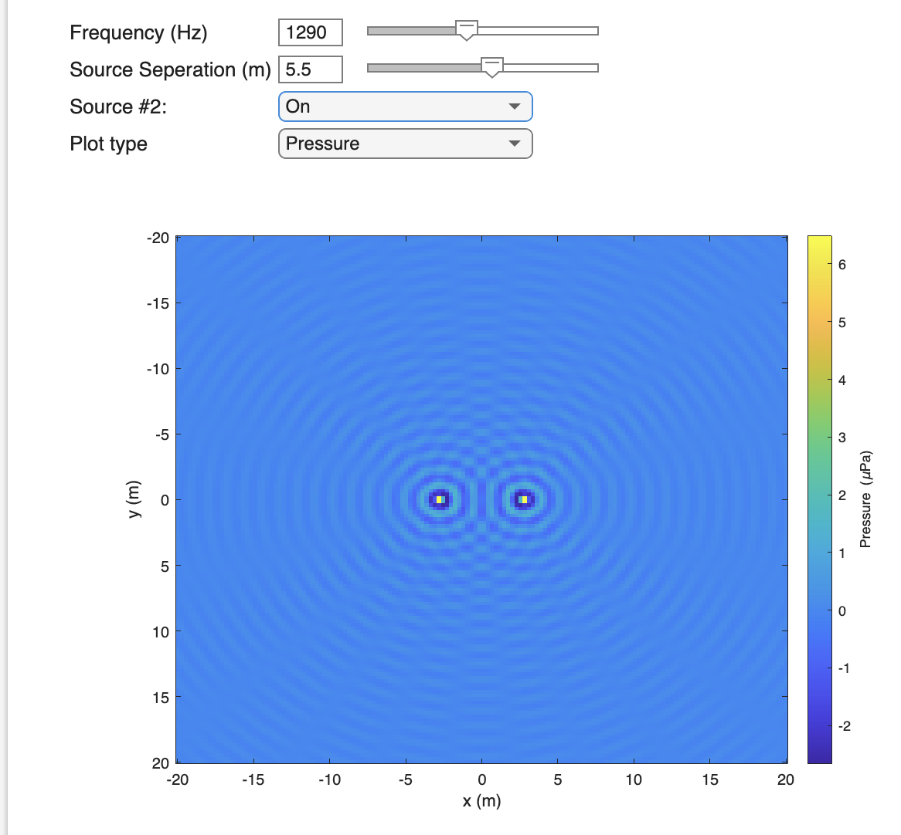

# The propagation of sound in open water

Before looking at how the underwater environment affects sound propagation, we will revisit the concept of the acoustic source. In _Acoustic Sources_, we discussed transducers, devices which convert electricity into motion which in turn produces sound. Transducers can come in all sorts of shapes and sizes with the most common being cylindrical or rectangular plates. For our purposes in this section, we will consider a very simple source: a small sphere. An ideal spherical source is one that uniformly expands and contracts, changing it's radius uniformly across the sphere, to produce sound that travels equally in all directions. An even more ideal version of this source is one where we reduce the radius of the spherical source so much that it occupies a point in space. This is the aptly named, "point source."

For a point source, the magnitude of the pressure is inversely proportional to the distance from the source, $P \propto 1/r$ , where $r$ is the distance from the source. The intensity of the sound is then proportional to the square of the distance, $I \propto 1/r^2$. In the remainder of this section, we will use this simple source to explore what happens to the sound it produces when we introduce other simple sources, changes in the properties of the water, or boundaries such as the sea surface or seafloor. To keep things simple, we will assume a source level, $SL$, of 0 dB, which means that at 1 m from the source, the magnitude of the pressure will be about 1.4 $\mu$Pa. (Footnote: Why consider an unrealistic point source instead of a more realizable, spherical source? Recall that as you move closer to a transducer you enter into the near field where the sound from different parts of the transducer surface interfere created a complicated sound field. The spherical source also has a near field, the boundary of which is proportional to both the frequency of the transmitted sound and the radius of the source. By reducing that radius to a point, we eliminate the near field. Thus the point source is a useful, but artificial sound source.)

Before we look at how the underwater environment affects the sound from our point source, we will begin by considering how the sound interacts sound. This interaction of sound with sound can be caused by multiple sources (as we will examine in this notebook) or by the environment reflecting or refracting the sound from a single source, causing it to interact with itself. When sound interacts with sound, two things happen:

1. The propagating sound doesn't change it's path or properties.
2. Sound propagating from different directions and/or with different frequencies will interfere with one another at the points where their paths intersect.

To see this, will use a simple widget that simulates the sound emitted by either one or two point sources. When source #2 is off, the plot shows the pressure or intensity of the sound from a single point source. When the plot is set to show pressure, there are rings of constant pressure surrounding the point source with the minima and maxima separated by a wavelength. These lines of constant pressure correspond to lines of constant phase in the wave and these lines are usually referred to as **wave fronts.** Sound always propagates at any instance in the direction perpendicular to any given wavefront. 

When the second source is turned on, those rings of pressure remain, but now there is **interference** between the two sound fields. Interference occurs because at each point the total pressure is the sum of the pressures from the the two sources. If the pressures are roughly the same (either both have positive or negative values), the addition leads to larger pressure magnitude. This is called __constructive interference__. When the pressures have opposite signs, the two pressures cancel which leads to **destructive interference.** This is more clearly seen in the intensity plot where the destructive interference is clearly seen in the lines of low intensity which pass between the two sources. 

<!--
Widget or python code corresponding to the Matlab script, 'TL_WIDGET_Multiple_Source.m'

-->

One other useful and somewhat artificial construct that we will often use is the **plane wave.** While the point source generates a sound field with spherical wavefronts, the plane wave is a sound wave that has a constant pressure level in two, orthogonal directions. For example, if a plane wave is propagating in a direction perpendicular to your computer screen, the pressure at any point on your screen (or even extending off or above your screen into the distance) will have the same pressure. 

