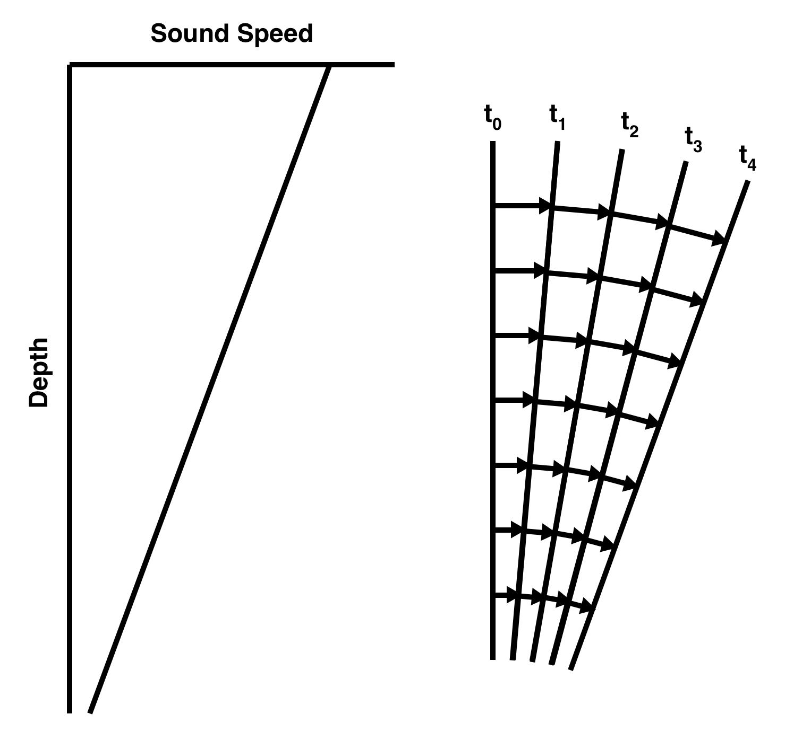
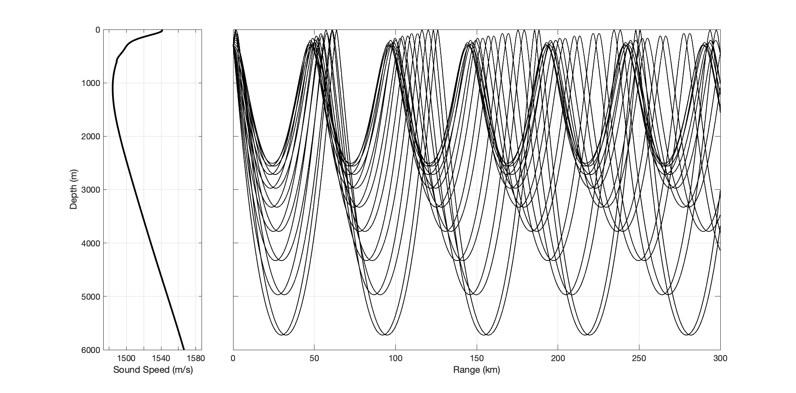
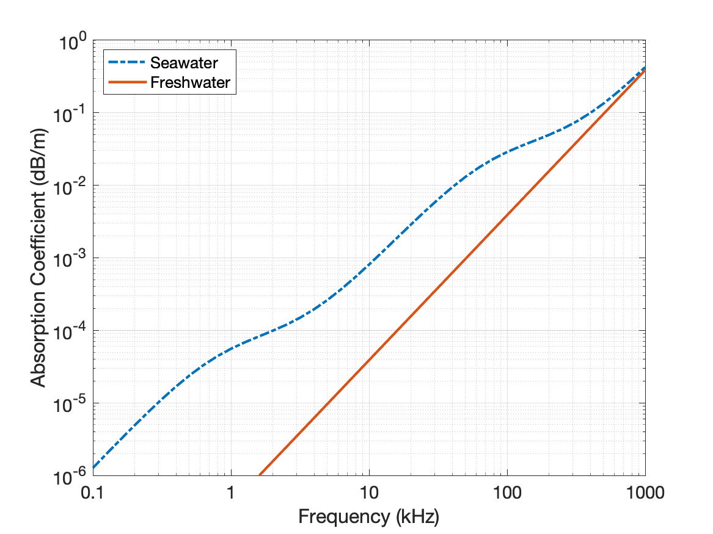

# Impact of water properties on propagation

(acoustics_refraction)=
# Refraction due to changes in sound speed

The speed with which sound travels through the ocean, the **sound speed**, depends on a number of properties of the seawater, with the temperature, salinity (salt content), and ambient pressure being the primary ones. These properties vary with both position and time in the ocean. In the summer, the water near the sea surface can be warmer than the deeper water. The ambient pressure increases the deeper you go in the ocean due to the weight of the water pushing down from the above. Fresh water flowing into the ocean from a river decreases the salinity near the river mouth. Each of these changes in the water properties leads to a change in the sound speed: the warm, near-surface water has a faster sound speed than the colder, deeper water, the sound speed increases as the ambient pressure increases with depth, and the fresher, river water decreases the speed of sound at the mouth of the river. All of these variations in properties compete with one another to increase or decrease the sound speed creating a complex acoustic environment.

While understanding how the sound speed depends on the changing oceanography is obviously important for predicting and understanding ocean acoustics, we need to first understand the consequences of the changing sound speed on the propagation of the sound. The speed of sound, $c$, is defined as the distance, $d$, that the sound travels divided by the time, $t$, it takes to travel that distance, or $c = d/t$. In water where the sound speed is the same value everywhere, also called **isovelocity**, the sound will travel at in straight lines as was the case in the two point source example.

When the sound speed depends on depth or horizontal position, instead of traveling in a straight line, it will instead **refract**, or bend away, from areas of high sound speed towards areas with low sound speed. To understand why this happens, consider the sound speed profile in the left panel in the image below. Here we have something similar to the summer warming effect we menitioned above, where the sound speed is high at the surface and then decreases linearly as you go deeper. Consider what would happen to a plane wave traveling in the horizontal direction.  At the initial instance of time, $t_0$, the wavefront is vertical and corresponds to the line labeled $t_0$ on the right hand side of the image. As we noted before, the sound always travels in the direction perpendicular to the wavefront. So for a small increment of time, the sound will travel in the horizontal direction and this is indicated by the horizontal arrows between $t_0$ and the next instance, $t_1$. However, since the sound speed decreases with depth, the sound at shallow depths (near the sea surface) will travel further than the sound at deeper depths. This difference in distance in represented by the differences in length of the arrows. The new wavefront at $t_1$ is now tilted forward. Since the sound always propagates in the direction perpendicular to the wavefront, the sound will now travel in a slightly downward direction. As time progresses, this happens again and again with the sound gradually moving away from the higher sound speeds. This illustration has exaggerated the length of the arrows. In actually the time increments would be infinitesimally small and the sound would follow a smooth curve away from the high sound speeds.

If the sound speed increased again at even deeper depths, the sound would again refract up and away from the deeper high sound speed regions. This is what happens to sound in the deep ocean and partially explains why whales can communicate with one another over vast distances. In the left plot below, the representative sound speed profile from the Pacific Ocean is shown as a function of depth. Near the surface and very deep the sound speed is high while towards the middle of the water column, the sound speed is low and has a minimum at about 1000 m. In left image, the path of the sound from a source located at a depth of 300 m is shown. The process of refraction from from the near surface and deep waters effectively traps the sound, preventing it from interacting with the sea surface or seafloor. This is kind of situation is called an acoustic duct or channel and this particular, deep water duct is known as the **SOFAR (Sound Fixing and Ranging) channel.** This channel can carry sound across an entire ocean and has been used by marine mammals and Navies for communication and echolocation over great distances.

(acoustics-water_absorption)=
# Absorption loss

While sound can be trapped in the SOFAR travel, limiting interactions with the sea surface and seafloor (which can lead to significant loss as discussed in [[TL_4_Reflection]]), the range at which sound can propagate depends also on the frequency of that sound. As the sound waves compress and expand the water, some of the energy used in the motion is converted to heat or lost to chemical reactions that take place within the water. Developing an understanding of the mechanisms behind these processes can be quite involved and will be left to future notebook. Here we will simply mention the processes and look at how they impact the propagation of sound.

All fluids have viscosity, which is the fluids resistance to flow. Molasses is the classic example of a highly viscous fluid, as is syrup. Water has a relatively low viscosity, but during the compression and expansion of the fluid in an acoustic wave, this viscous resistance leads to the loss of energy into heat. In freshwater, this is the only loss mechanism that occurs and it proportional to the square of the sound's frequency. 

In seawater, there are other chemicals present, the most prominent of which are dissolved salts. Among these salts, magnesium sulfate undergoes a chemical reaction due to the change of acoustic pressure which removes energy from the acoustic wave. This leads to an increase in the absorption, the onset of which occurs between 10 and 200 kHz and depends on both the temperature and acidity of the water. A second chemical reaction involving boric acid occurs at lower frequencies and also increases the absorption over that of freshwater.

Below is a plot of the absorption coefficient in dB/m versus frequency for freshwater and seawater. For these curves, the temperature of the water is assumed to be 5$^\circ$C, the salinity is 35 ppt, and ambient pressure is 1 atm. At 1000 kHz (1 MHz), the absorption in both freshwater and seawater is nearly 0.5 dB/m which means that the intensity is reduced by 10% after traveling one meter. For sound propagating in freshwater at 10 km, that same level of loss (10%) doesn't occur until the sound has traveled 4.3 km! For seawater, the sound only has to travel 1 km to experience the same level of reduction.

Returning to the SOFAR channel, the absorption experienced when sound propagates in seawater means that high frequency sound won't travel very far no matter how well it is trapped in the channel. Due to the strong frequency dependence of the absorption, low frequency sound can travel long distances with much loss. A 100 Hz tone transmitted in the SOFAR channel can travel 2000 km before it losses 3 dB (a 50% reduction) to absorption.
