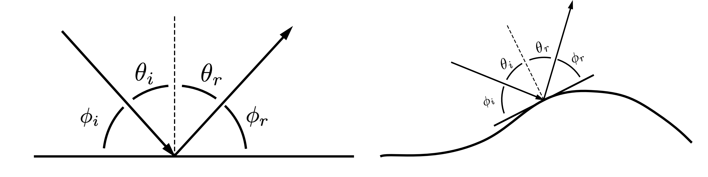

In this section, we turn our attention to the ocean boundaries, specifically the sea surface and the seafloor. When sound reflects from those surfaces, the magnitude of the reflected sound pressure either stays the same or decreases. The ratio of the reflected to the incident sound pressure is called the **reflection coefficient, R.** Similarly if sound penetrates or transmits into the surface, the ratio of the transmitted pressure to the incident pressure is the **transmission coefficient, T.** The sum of the reflected and transmitted pressures must be equal, so $R + T = 1$.
# Law of reflection

Anytime sounds interacts with a interface between water and some other material, there is the potential to reflect at least some of the sound energy back into the water. For reflection, the sound will obey a very simple rule: The angle at which the sound is reflected from a flat surface is the same as the angle of the incidence sound on the boundary. This the **law of reflection.** This is illustrated below. The flat, horizontal represents the interface while the arrows indicate the direction of the sound wave striking the interface from the left and reflecting to the right. The dashed line represents is a line that is perpendicular or normal to the interface. There are two sets of angle shown. The **incidence angles** are represented by $\theta$ and are defined as the angle between the sound and the perpendicular line. The **grazing angles** are are represented by $\phi$ and are defined as the angle between the sound and the interface itself. Usually you will only want to use one of these two types of angles when dealing with problems in ocean acoustics. The incidence angle is usually used when you are dealing with a system that is looking down such as an echosounder. For long range propagation in the ocean, since most of the sound is traveling horizontally, the grazing angle is typically used. The two types of angles are related, $\phi = 90^\circ - \theta$, so you can easily move back and forth between the two, but usually you want to pick the type that will allow you to consider a range of angles around $0^\circ$. 

Depending on which type of angle you use, the law of reflection can be written as $\phi_r = \phi_i$ or $\theta_r = \theta_i$. These angles are all measured relative to the interface. If the interface is slanted, wavy, or has some other shape to it, the angles will be measured relative to surface tangential to the point where the the sound strikes the surface. An example is shown in the right image above. The sound is now incident on a bump in the surface and the incident and reflected angles are defined relatively to the local surface.
# Reflection from the sea surface

Although the sea surface is a very dynamic interface, constantly changing and moving, we will consider only the simplest case: a perfectly flat sea surface. While the water is a fluid and has a density of 1000 kg/m$^3$, air is a gas with a density of 1.2 kg/m$^3$, about 1/800 of that of water. As a consequence of this mismatch in properties, very little sound is transmitted through the water/air interface and the sea surface can be approximated as a perfect reflector. Although the magnitude of the sound doesn't change, the reflected waveform does change sign, switching from positive to negative (or vice versa.) The reflection coefficient for the sea surface is therefore, $R = -1$ for all incidence angles. 

Even in rough sea conditions, treating the sea surface as flat can at times be a good approximation, particularly at low frequencies. At higher frequencies, the rough sea surface can scatter sound to many different angles, removing energy from the main propagation direction. There are different ways to include this effect and hopefully future notebooks will be added to address this.
# Reflection from the sea floor

Unlike the sea surface, the seafloor is typically composed of materials that have properties that are of the same order of magnitude as the sea water. These materials include sand, mud, rock, gravel, etc., which, while they have similar bulk properties such as sound speed and density, tend not to fluid like water. Despite this dissimilarity, it is often the case that we can approximate the seafloor as being a fluid. The mathematics behind the reflection from the interface between two fluids is fairly straightforward, treating the seafloor as a fluid greatly simplifies the propagation calculations. 

Earlier we examined to properties of the sea water, the sound speed and absorption. Similarly, when we treat the seafloor as a fluid, we need to know the sound speed and the energy loss in the sediment, which is typically referred to as the **attenuation.** Both absorption and attenuation denote a loss of energy from sound, but attenuation is a more general term as is applied to sediments because the losses can be due to mechanisms besides conversion to heat or chemical reactions as is the case with water. While the density of water does not play a significant roll in propagation of sound, the density contrast between water and the seafloor has a significant impact on reflection. Hence the seafloor density is a key parameter.

The table below shows typical sound speeds, densities, and attenuations for three different types of sediments. The attenuation is given in two different ways. The first is in dB/m, which is what used to describe the absorption in water. Here the attenuation is also a function of frequency so whenever dB/m is given, the frequency must be stated as well. In ocean sediments, the frequency dependence of the attenuation is often treated as being proportional to the frequency. One common wave to express the attenuation without specifying the frequency is to write it as dB/$\lambda$, where $\lambda$ is the wavelength of sound. Since the wavelength is inversely proportional to frequency, this expression for the attenuation is then proportional to the frequency.

| Sediment Type | Sound Speed (m/s) | Density (kg/m$^3$) | Attenuation (dB/m @ 400 kHz) | Attenuation (dB/$\lambda$) |
| ------------- | ----------------- | ------------------ | ---------------------------- | -------------------------- |
| Fine Sand     | 1725              | 2051               | 126                          | 0.55                       |
| Silty Mud     | 1473              | 1546               | 14                           | 0.05                       |
| Clayey Silt   | 1554.6            | 1745               | 72                           | 0.27                 |
      
Comparing these sediment properties to the properties of seawater, you'll notice that while the sediment density is always larger than that of seawater, the sound speed can be lower, as is the case with silty mud. Although our focus here is reflection, we will take a second to talk about transmission and specifically about **Snell's Law** which relates the angle of transmission, $\phi_t$, to the angle of incidence, $\phi_i$, and the ratio of the sound speeds in the water and in the sediment. Mathematically, this is expressed as,

$$ \cos\phi_t = \frac{c_s}{c_p}\cos\phi_t. $$

For a **slow sediment,** one where the sound speed is less than that in the water, this expression tells us that the grazing angle of the transmitted sound is going to greater than that of the incident sound (see the left side of the image below). For a **fast sediment,** where the sound speed is greater than that of water, the transmitted angle will be lower than the incident angle (right side of Fig. XX). For this type of sediment, there is a **critical angle** for the incident sound where the transmission angle becomes zero and no sound propagates into the sediment. For angles smaller than the critical angle, there is again no transmission and the reflection coefficient is very close to 1. 

For a slow sediment, there is always sound transmitted into the seafloor and hence since $R + T = 1$, the reflection will always be below 1. There is a special condition that can occur for slow sediments where the the transmission coefficient can become nearly equal to one. This occurs at what is known as the **angle of intromission**, which depends on both the sound speed and density ratios of the sediment to water. We won't go into the details of how and when this occurs but in the calculation of the reflection coefficient below, we will indicate when it occurs.

As we said earlier, the reflection coefficient for a fluid/fluid interface is straightforward to calculate and while we won't go into details of that calculation, the widget below will allow you to change the sediment parameters and see how the reflection coefficient changes. For this widget, we assume that the sound speed in water is 1500 m/s, the water density is 1000 kg/m$^3$, and frequency is 100 kHz. 

<!--
Widget or python code corresponding to the Matlab script, 'TL_WIDGET_Reflection_Coeff.m'

-->

# Addressing the complexity of real sediments

In the above discussion, we approximated the seafloor sediment as a fluid. Not only that, but we also assumed that it was infinitely deep. In reality, neither of those assumptions are true. A sand sediment is composed of both sand grains and water, rock is a solid, and mud can be a weird fluid/solid mix. The details of the sediment structure can have an impact both on how travels through the sediment and how it reflects. For example, like water, rock can support a compressional wave, but it can also support a shear wave, where the material moves up and down as opposed to compressing and expanding. This can have a significant impact on the reflection coefficient.  Also, the sediment is usually uniform. There can be layers with different properties, inclusions of other materials, and smooth variations of properties within the same sediment type. All of this is to say that while the fluid approximation can often work well, it isn't always going to work. Beware.  

